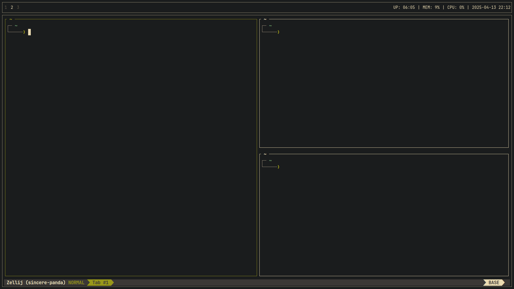

# Lucas's dotfiles 

Here you'll find a collection of configuration files for various tools and programs that I use on a daily basis.

**Warning:** If you want to give these dotfiles a try, you should first fork this repository, review the code, and remove things you don’t want or need. Don’t blindly use my settings unless you know what that entails. Use at your own risk!
