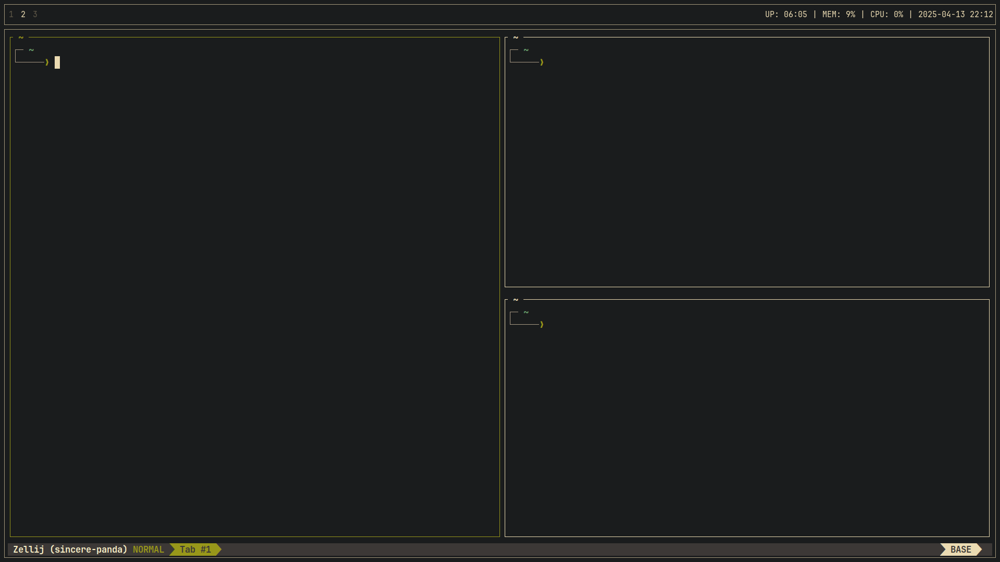

# Lucas's dotfiles 

Here you'll find a collection of configuration files for various tools I often use.



## Management

Instead of manually copying configuration files to different locations, this repository uses ***symbolic links***. To automate the symbolic linking process, I use a bash scriptthat takes care of creating links for all neccessary files.

## Installation

***Caution:*** Before running the setup script, ensure you back up your current configuration files. This script will ***overwrite existing files*** without warning. Use at your own risk!

### Steps

1. Clone the github repository:

```bash
git clone https://github.com/lucasherediadv/dotfiles.git
```

2. Enter the dotfiles directory:

```bash
cd dotfiles
```

3. Run the `setup` script:

```bash
./setup
```
